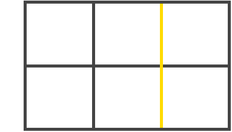

# Overview

- a two-dimensional CSS grid system
- use to lay out major page areas or small user interface elements

# Layout
A grid is a set of horizontal and vertical lines
- columns and rows 
- elements can be placed onto the grid

# Definitions

## container
- To work with grid, you need a grid container
- Create this with
```
#container {
    display: grid;
}
```

```
<main id="container">
    <div>A</div>
    <div>B</div>
    <div>C</div>
    <div>D</div>
    <div>E</div>
    <div>F</div>
</main>
```

## item / child
- any direct child/descendent of a grid container

```
<main id="container">
    <div>A</div>
    <div>B</div>
    <div><p>not a grid child</p></div>
    <div>D</div>
    <div>E</div>
    <div>F</div>
</main>
```
## grid line
- any of the lines of the grid



## track
- a row or column


## cell
- a single cell in the grid


## area
- an area on the grid


[source of images](https://css-tricks.com/snippets/css/complete-guide-grid/)


## Track
aka, row

## Area


Fixed and flexible track sizes
You can create a grid with fixed track sizes – using pixels for example. You can also create a grid using flexible sizes with percentages or with the new fr unit designed for this purpose.

Item placement
You can place items into a precise location on the grid using line numbers, names or by targeting an area of the grid. Grid also contains an algorithm to control the placement of items not given an explicit position on the grid.

Creation of additional tracks to hold content
You can define an explicit grid with grid layout but the specification also deals with content added outside of a declared grid, adding additional rows and columns as needed. Features such as adding “as many columns as will fit into a container” are included.

Alignment control
Grid contains alignment features in order that we can control how items align once placed into a grid area, and how the entire grid is aligned.

Control of overlapping content
More than one item can be placed into a grid cell, or areas can partially overlap each other. This layering may then be controlled with z-index.

Grid is a powerful specification and when combined with other parts of CSS such as flexbox, can help you to create layouts that were previously impossible to build in CSS. It all starts by creating a grid on your grid container.

The Grid containerEdit

We create a grid container by declaring display: grid or display: inline-grid on an element. As soon as we do this all direct children of that element will become grid items.

In this example, I have a containing div with a class of wrapper, inside are five child elements.